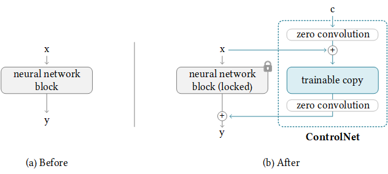

# ControlNet-Acceleration-on-RadeonProW7900
Accelerating ControlNet Pipeline through ROCm, Pytorch etc. Making it comparable performance as A100.


# Contents
- [Task Brief](#task-brief)
  - [Controlnet Introductions](#controlnet-introductions)
  - [Stable Diffusion + ControlNet](#stable-diffusion--controlnet)
  - [How to Accelerate this generation pipeline](#how-to-accelerate-this-generation-pipeline)
- [Environment Settings](#environment-settings)
  - [Hardware Preparation and OS Setup](#hardware-preparation-and-os-setup)
    - [Hardware elements](#hardware-elements)
    - [Power Settings(optional)](#power-settingsoptional)
    - [OS version and driver choices](#os-version-and-driver-choices)
    - [Set Groups permissions](#set-groups-permissions)
    - [Post-install verification checks](#post-install-verification-checks)
  - [Software Preparations(Conda Environment)](#software-preparationsconda-environment)
    - [Clone this repo](#clone-this-repo)
    - [Conda Environment](#conda-environment)
    - [Model Downloading](#model-downloading) 
    - [Run the code](#run-the-code)
- [Code explaination](#code-explaination)
- [References](#references)

## Task Brief
### ControlNet Introductions
intro based on Original [Code Repo](https://github.com/lllyasviel/ControlNet).
ControlNet 1.0 [Adding Conditional Control to Text-to-Image Diffusion Models](https://arxiv.org/abs/2302.05543) is a neural network structure to control diffusion models by adding extra conditions.



It copys the weights of neural network blocks into a "locked" copy and a "trainable" copy. 

The "trainable" one learns your condition. The "locked" one preserves your model. 

Thanks to this, training with small dataset of image pairs will not destroy the production-ready diffusion models.

The "zero convolution" is 1×1 convolution with both weight and bias initialized as zeros. 

Before training, all zero convolutions output zeros, and ControlNet will not cause any distortion.

No layer is trained from scratch. You are still fine-tuning. Your original model is safe. 

This allows training on small-scale or even personal devices.

This is also friendly to merge/replacement/offsetting of models/weights/blocks/layers.

### Stable Diffusion + ControlNet
By repeating the above simple structure 14 times, we can control stable diffusion in this way:


In this way, the ControlNet can **reuse** the SD encoder as a **deep, strong, robust, and powerful backbone** to learn diverse controls. Many evidences (like [this](https://jerryxu.net/ODISE/) and [this](https://vpd.ivg-research.xyz/)) validate that the SD encoder is an excellent backbone.

### How to Accelerate this generation pipeline

## Environment Settings
### Hardware Preparation and OS Setup
#### Hardware elements 
As for my choice of hardware, I consult the product brief on AMD offical websites about RadeonPro W7900(about 295W in docs, but I got 241W in rocm-smi), and pay more attention on stability of Power Supply, which I used a **1000W** in my case.

I rent a server with AMD 3945WX and 128GB RAM, and put the RadeonPro W7900 in the PCIe slot.

Here is system info:
```shell
❯ lscpu
...
CPU(s):                  24
  On-line CPU(s) list:   0-23
Vendor ID:               AuthenticAMD
  Model name:            AMD Ryzen Threadripper PRO 3945WX 12-Cores
...
❯ free -h
               total        used        free      shared  buff/cache   available
Mem:           125Gi        35Gi       951Mi       9.0Mi        89Gi        89Gi
Swap:           14Gi        14Gi          0B
```

#### Power Settings(optional)
No need when running this repo but recommended when training!
To avoid overheat, I put the server in a data center with cooling systems which can control the environment temperature to about **19** degree celcius, to reducing the heat pressure, I used [LACT](https://github.com/ilya-zlobintsev/LACT) to surpress the powerCap to **220W**, and finally got about 73 degree celcius for this card.

Note that this is only the apparent Pwr Consumption of the card, and the actual peak power consumption is more than this.
#### OS version and driver choices
The os versioni that shown in uname -a is:
```shell
❯ uname -a
6.2.0-26-generic #26~22.04.1-Ubuntu
```
The version of RadeonPro for Enterprise GPU Driver is, and can be found [here](https://www.amd.com/en/support/download/linux-drivers.html):
```shell 
amdgpu-install_6.0.60002-1_all.deb # my version# 

# install commands from AMD offical website with ROCm6.1.3
sudo apt update
wget https://repo.radeon.com/amdgpu-install/6.1.3/ubuntu/jammy/amdgpu-install_6.1.60103-1_all.deb
sudo apt install ./amdgpu-install_6.1.60103-1_all.deb
sudo amdgpu-install -y --usecase=graphics,rocm
sudo usermod -a -G render,video $LOGNAME
```
#### Set Groups permissions
```shell
sudo usermod -a -G render,video $LOGNAME
sudo reboot
```
#### Post-install verification checks
Verify that the current user is added to the render and video groups.
```shell
# 1 check groups
groups
#output
<username> adm cdrom sudo dip video plugdev render lpadmin lxd sambashare
```

Check if amdgpu kernel driver is installed.
```shell
# 2 check gpu driver kernel module
dkms status

#output
amdgpu/x.x.x-xxxxxxx.xx.xx, x.x.x-xx-generic, x86_64: installed
```
Finally, check rocminfo:
```shell
# 3 check rocminfo (very important and can affect the following steps, especially the pytorch cuda support)
❯ rocminfo

# output
[...]
*******
Agent 2
*******
  Name:                    gfx1100
  Uuid:                    GPU-5ecee39292e80c37
  Marketing Name:          Radeon RX 7900 XTX
  Vendor Name:             AMD
  [...]
[...]
```

### Software Preparations(Conda Environment)
There are two ways to run this repo, one is through docker, and the other is through conda environment. Here I will introduce the conda environment settings.
#### Clone this repo
```shell
git clone https://github.com/jedibobo/ControlNet-Acceleration-on-RadeonProW7900.git
```
#### Conda Environment
First create a new conda environment

    conda env create -f environment.yaml
    conda activate control

Second replace the nvdia cuda pytorch to ROCm enabled Pytorch. The command can be found in Pytorch offical website.
```shell
pip3 install torch torchvision torchaudio --index-url https://download.pytorch.org/whl/rocm6.0
```
Third verify pytorch installation and GPU support:
```shell
❯ python
Python 3.9.19 (main, Mar 21 2024, 17:11:28) 
[GCC 11.2.0] :: Anaconda, Inc. on linux
Type "help", "copyright", "credits" or "license" for more information.
>>> import torch
>>> torch.cuda.is_available()
True
>>> torch.cuda.get_device_name(0)
'AMD Radeon PRO W7900'
```

FAQ:

1.If return "False" in torch.cuda.is_available(), please first check if "rocminfo" command returns valid information instead of "no permission" errors. If the latter comes up, please refer to this [link](https://github.com/ROCm/ROCm/issues/1211) and this [link](https://github.com/ROCm/ROCm/issues/1798) to resolve this issue.

#### Model Downloading
Download model control_sd_canny.pth  from [huggingface](https://huggingface.co/lllyasviel/ControlNet/tree/main/models), and place it in models dir.

#### Run the code
```shell
python3 compute_score.py
```
Output image:


#### Speed Comparison
The speed comparison between A100 and RadeonPro W7900 is shown below table:
| Model | A100 40G PCIe | RadeonPro W7900 |
| --- | --- | --- |
| Latency | 2100.738 ms | 2197.282 ms |
| PowerCap | 250W | 241W |

This shows potential of RadeonPro W7900 in accelerating the ControlNet pipeline, which is comparable to A100.


### Software Preparations(Docker)(Optional method)
For docker setup, I recommend to use root and the official ROCm pytorch docker image. The commands are shown below:
```shell
#1. Install Docker following https://docs.docker.com/engine/install/ubuntu/

#2. Pull ROCm docker image
docker pull rocm/pytorch:rocm6.1.3_ubuntu22.04_py3.10_pytorch_release-2.1.2

#3. Run the docker image
sudo docker run -it --network=host --device=/dev/kfd --device=/dev/dri -v $PWD:/workspace/ --group-add=video --ipc=host --cap-add=SYS_PTRACE --security-opt seccomp=unconfined --shm-size 64G --name control-rocm613-pyt212 rocm/pytorch:rocm6.1.3_ubuntu22.04_py3.10_pytorch_release-2.1.2 bash

#4. pull this repo and install python requirements
git clone https://github.com/jedibobo/ControlNet-Acceleration-on-RadeonProW7900.git
pip install -r requirements.txt
# Note this step should not change the pytorch version in the docker.
```

## Code explaination
class ```amdpervasivecontest``` with two methods: ```initialize``` and ```process```.

```initialize method```: This method initializes some necessary objects and models. First, it creates a CannyDetector object for edge detection. Then, it loads a pre-trained model and places it on the GPU for computation. Finally, it creates a DDIMSampler object for sampling operations.

```process method```: This method processes an input image based on various parameters. Here's a step-by-step breakdown:
- It resizes the input image to the specified resolution.
- It applies the Canny edge detection to the resized image.
- It converts the detected map to a PyTorch tensor and prepares it for the model.
- It sets a random seed for reproducibility if no seed is provided.
- It prepares the conditioning for the model based on the prompts and control map.
- It adjusts the model's control scales based on the guess_mode and strength parameters.
- It uses the DDIMSampler to generate samples based on the provided parameters.
- It decodes the samples to get the final images and returns them.

## Some failed attempts
### 1. ROCm Xformers Installation(both conda and docker)
### 2.ROCm DeepSpeed Installation(docker)

## References
- [ControlNet official repository](https://github.com/lllyasviel/ControlNet)